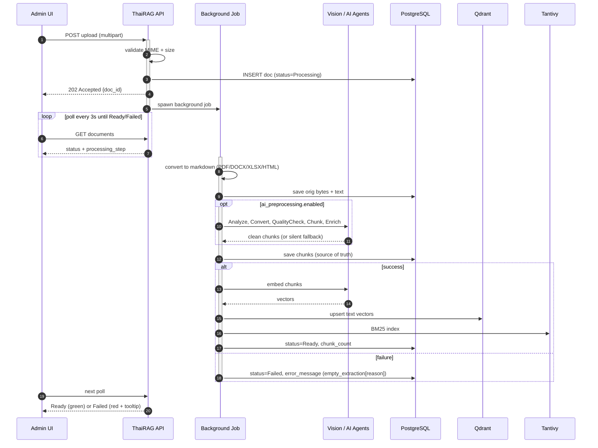
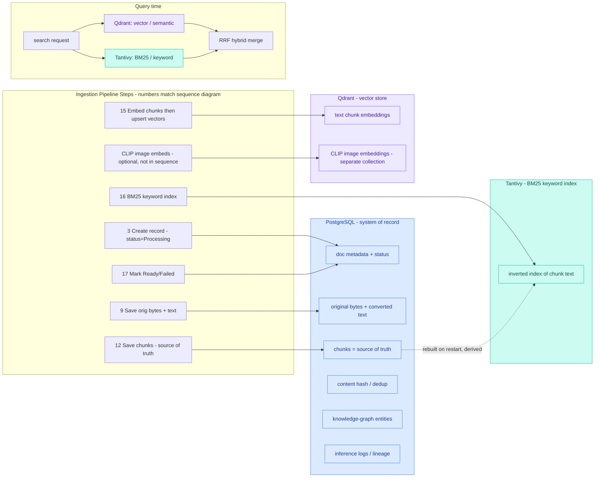

# Document Processing Flow

How a document moves from an upload on the Admin UI `/documents` page to a
searchable, indexed document — and where it can fail at each step.

This is the reference for triaging ingestion issues: find the step matching a
document's stuck `processing_step`, then check the store / dependency it touches.

## Sequence (time-ordered)

## Routing: background vs inline

`should_process_in_background()` (`crates/thairag-api/src/routes/documents.rs`)
sends a document to a background job when any of these hold; otherwise it runs
inline and returns the real chunk count synchronously:

- file size > 1 MB
- MIME type is `application/pdf` or `image/*` (slow vision path)
- `ai_preprocessing.enabled` is set

Background uploads return `202 Accepted` with `chunks = 0`; the UI polls every 3s
until the status flips. Inline uploads return `201 Created` with the chunk count.

## Thai documents & PDF conversion

The **convert-to-markdown** step (sequence step 35) is language-agnostic — it
holds **no** Thai-specific logic. Thai word segmentation (the `thairag-thai`
crate) runs strictly *downstream* of conversion:

- **Chunking** — `thai_chunker.rs` (`DictionarySegmenter`) splits on Thai word
  boundaries (Thai has no spaces between words).
- **BM25 indexing** — the Tantivy Thai tokenizer (`tantivy_tokenizer.rs`).
- **Query time** — the orchestrator segments the incoming query the same way.

So the choice of converter does **not** change how Thai is handled later — it
only changes how faithfully the source text is extracted in the first place.

**Chunking always consumes the converted text, never the raw file.** The
pipeline converts bytes → text and feeds *that text* to the chunker
(`pipeline.rs`, `self.converter.convert(raw, mime_type)` → `chunk_text`); the
raw document is never chunked directly. Note the pipeline re-converts the raw
bytes internally rather than re-reading the preview blob saved at upload, so
conversion runs twice from the same source. For the mechanical path both
produce identical text; the smart-PDF path produces richer semantic markdown and
then overwrites the preview blob so the preview matches what was chunked.

**Prefer DOCX (or any native digital-text source) over PDF for Thai.** DOCX,
XLSX, and HTML carry structured digital text that extracts cleanly. PDF text
extraction (`pdf-extract`) frequently mangles Thai — dropped word spacing,
broken combining/tone marks, reordered glyphs — because a PDF stores positioned
glyphs, not logical text. If you have the DOCX a PDF was exported from, **upload
the DOCX instead.**

For PDFs that are scanned or have image-only / tabular pages, the **smart-PDF
vision path** can OCR them page-by-page, but it is **config-gated and off by
default** (slow, RAM-heavy). It requires a vision-capable model and these
document-config knobs:

| Knob | Role |
| --- | --- |
| `vision_llm` | dedicated vision model (else the main LLM must be vision-capable) |
| `image_description_enabled` | master switch for the vision path |
| `pdf_vision_fallback_enabled` | rasterize + OCR pages whose extracted text is too short |
| `pdf_min_chars_per_page` | threshold under which a page is treated as "no text" and sent to vision |
| `pdf_max_vision_pages` | per-document budget cap on vision-LLM calls |
| `pdf_image_dpi` | render DPI for rasterized pages (higher = sharper but more RAM) |

All of these except `vision_llm` are editable and hot-reloadable from the admin
UI's **Document Processing → Pipeline Settings → Smart-PDF Vision OCR** section;
`vision_llm` is set via the Converter agent's LLM (or `providers.vision_llm`).
The fallback only fires on pages below the char threshold, so a digital-text PDF
skips vision entirely.

## Which store does each step write?

| Step | Writes to | What |
| --- | --- | --- |
| Create record | PostgreSQL | doc metadata, `status`, `processing_step` |
| Convert | PostgreSQL | original bytes + converted markdown (for preview) |
| Chunk + enrich | PostgreSQL | chunks — **source of truth**, used to rebuild Tantivy |
| Embed chunks | Qdrant | text-chunk vectors (semantic search) |
| CLIP image embeds (optional) | Qdrant | image vectors in a separate collection |
| Keyword index | Tantivy | BM25 inverted index (derived; rebuilt from PG on restart) |
| Mark Ready/Failed | PostgreSQL | final `status`, `chunk_count`, `error_message` |

At query time, Qdrant (vector) and Tantivy (BM25) are combined via an RRF hybrid
merge. PostgreSQL is the system of record; Tantivy is a derived index.

## Where to look when it breaks

- **UI**: Documents table status chip + Jobs table (background job state).
- **API**: the document's `error_message` and `processing_step` fields.
- **Failure codes**: `empty_extraction[<reason>]` — e.g. `no_text_vision_unavailable`,
  `no_text_vision_failed`, `vision_budget_exceeded`, `no_text_no_fallback`.
- **Dependencies**: Ollama (`:11435`) backs embedding (step 13) and the AI agents;
  the vision LLM backs conversion and the agents; a missing embedding model
  (e.g. `qwen3-embedding:0.6b` not pulled) surfaces as a 404 during indexing.

## Key code references

- Upload handler: `upload_document()` — `crates/thairag-api/src/routes/documents.rs`
- Processing core: `process_document_inner_impl()` — same file
- Converter: `MarkdownConverter::convert_with_stats()` — `crates/thairag-document/src/converter.rs`
- AI pipeline: `AiDocumentPipeline::process()` — `crates/thairag-document/src/ai/pipeline.rs`
- Indexing: `HybridSearchEngine::index_chunks()` — `crates/thairag-search/src/hybrid.rs`
