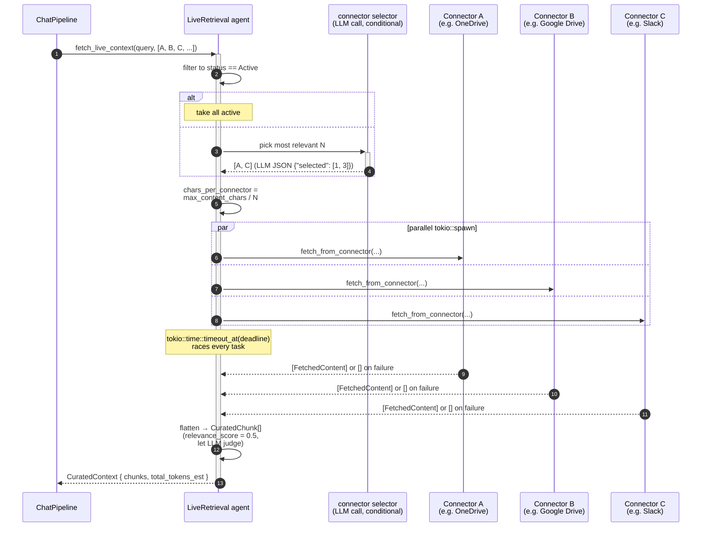
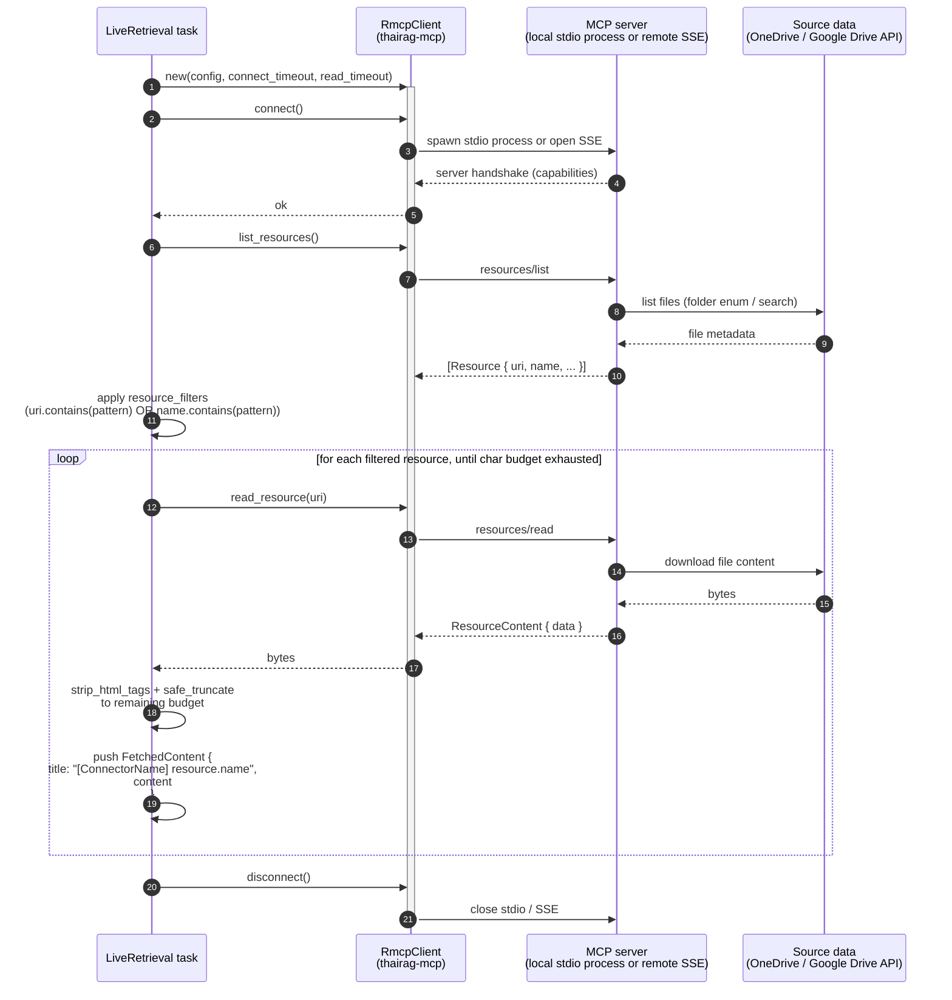
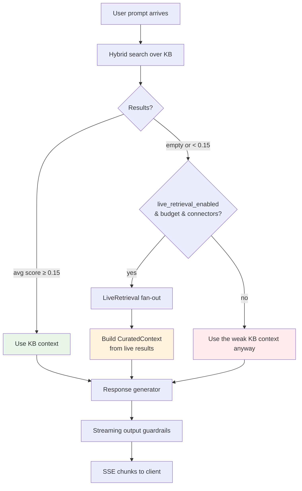

# Operator Guide

How to run ThaiRAG in production: how to size and lay out the infrastructure, how documents flow through the system, how to take care of the vector DB, when content is pre-indexed vs fetched on the fly, and what an operations checklist looks like.

This is the missing middle between:

- **DEPLOYMENT_GUIDE.md** — *how to install*. Compose files, env vars, config keys.
- **INTEGRATION_GUIDE.md** — *how external clients talk to the server*. Open WebUI, SSO, API clients.
- **ARCHITECTURE.md** — *how the code is structured*. Crate layering, data flow.

If you're reading this, you've installed the system and now you have to *run* it.

---

## 1. Infrastructure prep

### 1.1 Topology

The minimum ThaiRAG deployment is **three processes** plus optional infrastructure:

```
                ┌────────────────┐
                │   Admin UI     │  (Node/nginx, port 8081)
                └───────┬────────┘
                        │
                ┌───────▼────────┐
                │  ThaiRAG API   │  (Rust binary, port 8080)
                └───┬────────┬───┘
                    │        │
            ┌───────▼─┐   ┌──▼──────────┐
            │ Postgres│   │ Vector DB   │  (Qdrant / pgvector / Chroma / Milvus / Weaviate / Pinecone / InMemory)
            └─────────┘   └─────────────┘
```

Optional but recommended above small-team scale:

- **Redis** — session store + embedding cache + job queue. Required for **multi-instance API** deployments (DashMap session store can't share state across replicas). Single API instance can use the built-in in-memory implementations.
- **Ollama** — local LLM + embedding backend for the free tier. Pin to a host with a GPU (Metal on Apple Silicon, CUDA on NVIDIA) for usable throughput.
- **Prometheus + Grafana** — wired into the compose stack; scrapes `/metrics` at the API port.
- **OpenTelemetry collector** — when `otel.enabled = true`, OTLP traces and metrics flow to your collector of choice.

### 1.2 Sizing the API instance

Per-replica resource floor at idle (no concurrent queries):

| Resource | Free tier (Ollama) | Standard (Claude+OpenAI) |
|---|---|---|
| CPU | 2 vCPU | 1 vCPU |
| RAM | 4 GB (without LLM/embedding loaded in-process) | 1.5 GB |
| Disk | 20 GB for Tantivy + Postgres growth | 10 GB |

Per concurrent chat request: ~50–200 MB working set (depends on context window and `max_context_tokens`). The hot path is dominated by I/O to LLM/embedding providers, not local CPU — so scale horizontally by adding API replicas behind a load balancer rather than vertically.

### 1.3 Behind a load balancer

When you run more than one API replica:

- **Session store**: switch to Redis (`session.kind = "redis"`). DashMap-only deployments will look correct in dev but lose conversation state on every request that lands on a different replica.
- **Embedding cache**: switch to Redis (`embedding_cache.kind = "redis"`). Otherwise each replica pays the embedding cost independently for the same text.
- **Job queue**: switch to Redis if you use connector sync, batch ingest, or scheduled refresh.
- **Sticky sessions**: not required if all three above are on Redis.
- **WebSocket affinity**: required only if you use `/ws/chat`. SSE chat works without it.
- **Health-check endpoint**: point the LB at `GET /health` (cheap, always returns 200 if the binary is live). Use `GET /health?deep=true` from a dedicated readiness probe — it pings the LLM, embedding, and vector store providers, so it'll return 500 when an upstream is degraded.

### 1.4 Secrets

Everything sensitive — LLM API keys, OAuth client secrets, OIDC discovery URLs, LDAP bind passwords — lives in **Vault** (the built-in encrypted key store at `crates/thairag-api/src/vault.rs`), not in env vars or config files. Vault uses a master key from the `VAULT_MASTER_KEY` env var to encrypt at rest under `vault/`. Provider configs reference vault entries by `profile_id`; the runtime resolves them via `resolve_profile()` at every bundle rebuild.

Do **not**:
- Put LLM API keys directly in `config/local.toml` or `THAIRAG__PROVIDERS__LLM__API_KEY`. That leaks them into config snapshots and audit logs.
- Commit the vault directory.
- Reuse the same `VAULT_MASTER_KEY` across environments.

### 1.5 Images

Pre-built images are published as **multi-arch manifests** (linux/amd64 + linux/arm64). The same tag pulls correctly on x86 production servers and Apple Silicon dev machines. Available on both GHCR (`ghcr.io/jay-githubs/thairag`) and Docker Hub (`jdevspecialist/thairag`); see DEPLOYMENT_GUIDE.md for the registry switch.

For air-gapped environments: build from source against the published `rust:1.88-bookworm` base, then re-tag and push to your internal registry.

---

## 2. Document lifecycle

This is the section most operators get confused about. There are **three** ways content reaches the chat pipeline. They are not alternatives — they coexist and complement each other.

### 2.1 The three paths

| Path | Trigger | Persisted to KB? | Embedded? | Retrieval cost at query time |
|---|---|---|---|---|
| **Upload** | `POST /api/km/.../documents/upload` (API) or the Documents admin page | ✅ Yes | ✅ Yes — embedded + chunked + indexed in Tantivy at ingest time | Fast — hybrid search hits local indexes |
| **Connector sync** | Manual button or `schedule_cron` on an `McpConnectorConfig` | ✅ Yes — into the configured `workspace_id` | ✅ Yes — same pipeline as uploads | Fast — once sync completes, content behaves exactly like uploads |
| **Live retrieval** | Automatic, at chat time, when KB coverage is poor | ❌ No — transient context only | ❌ No — content is read fresh from the connector for this request and dropped after | Slow — fan-out to MCP connectors, network I/O |

**The answer to "do I always need to embed?"** is **no for connector content**, **yes for uploaded files**. Upload exists *to* persist; if you don't want persistence, don't upload — wire a connector and let live retrieval handle it. But uploads are almost always the right choice for content you actually own (PDFs, internal docs, reports).

### 2.2 When live retrieval fires

The pipeline always runs hybrid search first. Then `chat_pipeline.rs::maybe_live_retrieve` checks four conditions and only proceeds if **all** are true:

1. `chat_pipeline.live_retrieval_enabled = true` in config.
2. The bundle was built with a `LiveRetrieval` agent (it is, when the config flag is on).
3. **KB coverage is insufficient.** Either zero retrieved chunks, or average relevance score < `0.15`.
4. There are active connectors visible to the requesting user's `AccessScope`.

Then it fans out to up to `live_retrieval.max_connectors` connectors in parallel, with a per-connector content budget of `max_content_chars / num_connectors`. If more connectors are configured than the cap allows, an LLM call picks the most relevant ones.

**Result**: the original (poor) context is replaced with the live-fetched content. The model sees fresh content; the KB is unchanged.

### 2.3 Choosing between upload and connector sync

Use **upload** when:
- The content is yours to own (you wrote it, you store the canonical copy).
- It's a static-ish document (slow churn).
- You want fine-grained ACL on it (uploaded docs support per-doc ACL via `crates/thairag-api/src/routes/documents.rs::ACL Management`).
- You want full versioning + diff (upload supports this; connector sync replaces).

Use **connector sync** when:
- The source of truth lives elsewhere (Confluence, Notion, SharePoint, etc.) and you want it mirrored.
- The content changes frequently and you want a cron to keep it fresh (`schedule_cron: "0 */6 * * *"` for every 6 hours).
- The MCP server already exposes the right resource filters.

Use **live retrieval only** (no sync configured) when:
- The content is too volatile to be useful at rest (Slack messages from yesterday, today's commit log).
- You can't afford the embedding cost to mirror a huge corpus.
- You want privacy (no copy at rest), accepting the per-query latency.

### 2.4 Versioning and refresh

Uploaded documents track a `version` integer that increments every time the file is replaced. Old versions are accessible via the admin UI's **Version History** with a side-by-side diff. The `refresh_schedule` field on a document (`"1h"`, `"6h"`, `"1d"`, `"7d"`, `"30d"`) re-fetches the source on schedule and creates a new version automatically — useful for documents that point at a remote URL.

Connector sync runs are tracked separately in `sync_runs` rows. Each run records created / updated / skipped / failed counts plus a duration histogram so `/metrics` shows scrape-able trends.

### 2.5 ACL

Permissions are layered: **org → dept → workspace** with optional **per-document ACL** on top. A user inherits the lowest-level permission that applies — workspace-level grants give access to everything in the workspace; doc-level ACL can further restrict a sensitive subset. The chat pipeline filters retrieved chunks by the caller's `AccessScope` before they reach the LLM, so an unauthorized document never enters the context window.

### 2.6 Bulk ingest

For first-time backfill of a large corpus:
1. Pre-flight: confirm the embedding model and dimension you want. **Do not change them after bulk ingest** — see §3.2.
2. Use `POST /api/km/.../documents/upload` with batched multipart uploads, not one-by-one.
3. Increase `max_items_per_sync` on connectors if you're using sync.
4. Monitor `/metrics` for `mcp_sync_items_total{action="failed"}`; a steady fail rate often means rate-limiting on the source side, not a bug.
5. Reserve ingest to off-peak windows. Embedding API calls compete with chat traffic for provider rate limits.

---

## 3. Vector DB best practices

### 3.1 Picking an embedding model and dimension

Constraints in priority order:

1. **Dimension must match the vector DB collection.** Qdrant collections are created with a fixed dim at first write; you cannot change it in place. Switching models = switching collections (the migration tool handles this; see §3.3).
2. **The vector store must auto-detect or be explicitly told the dim.** ThaiRAG checks `providers.embedding.dimension` at startup; if Qdrant reports a different dimension than the config, the server refuses to start.
3. **Cost per million tokens** (most expensive single line in your bill at scale, more than chat completions for read-heavy KBs).
4. **Multilingual quality.** Thai is a stress test — `text-embedding-3-large` (OpenAI, 3072d), `nomic-embed-text-v1.5` (1024d, free via Ollama), and the FastEmbed multilingual default are the practical choices.

Defaults shipped:

| Tier | Provider | Model | Dim |
|---|---|---|---|
| Free | FastEmbed (in-process) | `BAAI/bge-small-en-v1.5` | 384 |
| Free + Ollama | Ollama | `nomic-embed-text` | 768 |
| Standard | OpenAI | `text-embedding-3-large` | 3072 |

For Thai-heavy corpora, prefer Ollama + `nomic-embed-text` (free, decent multilingual) or OpenAI `text-embedding-3-large` (best quality, paid).

### 3.2 The embedding fingerprint

On every startup, the server computes an **embedding fingerprint** — `kind:model:dimension` — and stores it in the KV store under `_embedding_fingerprint`. Why: if you change the embedding model out-of-band (e.g., edit `config/local.toml` and restart), the existing vectors in your DB are now garbage from the new model's perspective. The fingerprint check makes the mismatch loud instead of silent.

**Behavior** on mismatch:
- The server starts (it doesn't refuse).
- A warning is logged.
- Chat search continues to work but quality collapses (queries embed with the new model; documents are still under the old).

**Resolutions**, in increasing order of expense:
1. Revert the config change. Fingerprint matches again. Done.
2. Use the vector migration tool to switch backends without re-embedding (only valid if `kind` changed but `model` and `dimension` are identical — e.g., Qdrant → pgvector with the same OpenAI embeddings).
3. **Re-embed everything**. There's no other way out if dim changed. See §3.4.

### 3.3 Vector migration

The Vector Migration page (super-admin only) walks you through a four-step flow when you change vector DB backends:

1. **Start** — provide the target backend config (Qdrant URL + collection, or pgvector connection string). Background job copies vectors batch-by-batch from the live store to the target.
2. **Validate** — counts and samples a few vectors on each side. Marks as `Validated` if they match.
3. **Switch** — atomically swaps the `provider_config.vector_store` in the KV store and triggers a `reload_providers` to rebuild the bundle. Reads now go to the new backend.
4. **Cleanup** — optional. After a soak period you delete the old collection.

Migration **only works** when the embeddings themselves don't change — same `kind:model:dimension` triple. It is not a "wipe and re-embed" tool; it's a "move the same vectors to a different backend" tool.

### 3.4 Re-embedding (the expensive option)

When you legitimately need to change the embedding model (better Thai quality, cheaper API, etc.):

1. Backup. Snapshot the database, snapshot the vector store. `docs/DEPLOYMENT_GUIDE.md` shows the volumes; `scripts/docker-rebuild.sh` does this for the local stack.
2. Drop the old vector collection / wipe pgvector / point Qdrant at a fresh collection name.
3. Update `providers.embedding.model` (and `dimension`) in config.
4. Restart. The embedding fingerprint will mismatch — that's expected; the next step fixes it.
5. Trigger a **reindex** of every document. The easiest way is the per-document **Reprocess** button in the admin UI, or `POST /api/km/.../documents/{doc_id}/reprocess` via the API for scripted bulk. There's also a `cargo run --bin thairag-cli -- reindex` if you maintain CLI scripts.
6. Wait for embeds to drain. Watch `mcp_sync_items_total{action="created"}` and `llm_tokens_total{type="prompt"}` to gauge progress.

Budget: typical 4 KB text chunk × `text-embedding-3-large` ≈ $0.0001 per chunk at OpenAI prices. Multiply by your chunk count. Free-tier FastEmbed has zero API cost but a chunky CPU bill.

### 3.5 Backup and disaster recovery

- **What to back up**: the SQLite/Postgres DB, the vault directory, the vector store volume, the Tantivy index directory.
- **What's safe to lose**: the Tantivy index — it auto-rebuilds on startup from the `document_chunks` table. The embedding cache (in-process or Redis) — it warms back up.
- **What's *not* safe to lose**: the vector store and the vault. Vault loss means you lose the encryption key chain — provider profiles become unusable and you'll re-key.

The Backup & Restore admin page exports the whole system as a ZIP with a manifest. **Backup before any Docker rebuild** — the volume recreation defaults bite hard.

---

## 4. Live retrieval, clarified

This is the path the API_REFERENCE doesn't say much about, and it's the source of the "do I always need to embed?" confusion.

### 4.1 The mental model

Think of live retrieval as **best-effort just-in-time lookup**. It's not a separate ingestion path you choose; it's an automatic fallback path the chat pipeline takes when the KB came up empty.

```
User query
   │
   ▼
Hybrid search over KB
   │
   ├──── good context found (avg score ≥ 0.15) ──────────────► Use it. Done.
   │
   └──── empty or weak context (< 0.15) ──► is live_retrieval enabled?
                                                │
                                                ├── no ──► Use the weak context anyway.
                                                │
                                                yes
                                                │
                                                ▼
                                            Fan out to active MCP connectors in parallel.
                                            Read resources, build a CuratedContext.
                                            Replace the weak context with live results.
                                            Generate response.
                                            Discard live content after the request.
```

### 4.2 Configuration

In `config/local.toml`:

```toml
[chat_pipeline]
live_retrieval_enabled = true

[chat_pipeline.live_retrieval]
# How many connectors to fan out to in parallel before falling back to an LLM
# call to pick the best ones.
max_connectors = 3
# Total content budget across all selected connectors. Divided evenly per
# connector. Bigger = more context for the LLM, more latency.
max_content_chars = 16000
# Overall timeout for the whole fan-out. Tune up for slow MCP servers.
timeout_secs = 30
# Per-connector connect / read timeouts.
connect_timeout_secs = 5
read_timeout_secs = 15
# Tokens to spend on the optional "pick relevant connectors" LLM call.
max_tokens = 256
```

Connectors are wired separately at `/connectors` in the admin UI. Live retrieval reuses whatever you've already configured for sync; you don't double-register them.

### 4.3 The 0.15 threshold

`0.15` is the average relevance score below which the pipeline considers the KB result "insufficient" and triggers live retrieval. This is the RRF-merged score from hybrid search, not a raw similarity. Practical interpretation:

- **0.50+** — strong match. Use it. Live retrieval never fires.
- **0.15 – 0.50** — moderate match. Use it without live retrieval.
- **0.00 – 0.15** — weak match (or empty). Live retrieval fires if enabled.

If you find live retrieval firing too often (and you've intentionally bulk-ingested a corpus), it usually means the embedding model is mismatched to your domain — see §3.1. Tightening the threshold doesn't fix the underlying problem; it just hides it.

### 4.4 Failure modes

| Symptom | Likely cause | Fix |
|---|---|---|
| Live retrieval never fires even though KB is empty | `live_retrieval_enabled = false`, or no connectors in the user's scope | Check the chat pipeline config; verify the user has access to a workspace with active connectors |
| Live retrieval times out | MCP connector hangs (broken transport, dead Slack token, etc.) | Tighten `connect_timeout_secs`; mark stale connectors `Inactive` on `/connectors` |
| Live retrieval works but the LLM ignores the content | `max_content_chars` too low; fan-out spread the content too thinly | Raise the budget or lower `max_connectors` |
| Live retrieval fires too often | Embedding mismatch; KB content not actually retrievable | §3.1 / §3.2; re-embed if the model is wrong for your language |

### 4.5 Sequence diagrams: what happens when a user prompts

This is the most-asked question: *"If I haven't synced/embedded my OneDrive or Google Drive into ThaiRAG, what actually happens when a user asks a question that needs those files?"*

Three diagrams, increasingly zoomed in.

#### 4.5.1 End-to-end: KB-empty → live retrieval → response

```mermaid
sequenceDiagram
    autonumber
    participant U as User
    participant API as ThaiRAG API
    participant AUTH as auth_layer<br/>(JWT + AccessScope)
    participant G as InputGuardrails
    participant CP as ChatPipeline
    participant SE as HybridSearchEngine<br/>(VectorDB + Tantivy)
    participant LR as LiveRetrieval agent
    participant MCP as MCP Connectors<br/>(OneDrive / Google Drive / Slack / ...)
    participant LLM as LLM provider
    participant SG as StreamingGuardrails<br/>(sliding-window hold-back)

    U->>+API: POST /v1/chat/completions<br/>{messages, stream: true}
    API->>AUTH: validate JWT
    AUTH-->>API: AccessScope (orgs/depts/workspaces)
    API->>+CP: process(messages, scope, ...)

    CP->>G: check(user query)
    G-->>CP: Pass (or Block → refusal stream)

    CP->>SE: hybrid search(rewritten query, scope)
    Note over SE: vector + BM25 + RRF + rerank
    SE-->>CP: results (likely empty —<br/>nothing was uploaded)

    CP->>CP: avg(relevance) < 0.15<br/>AND live_retrieval_enabled<br/>AND budget remaining?

    alt KB coverage insufficient
        CP->>+LR: fetch_live_context(query, connectors_for_scope)
        Note over LR: see diagram 4.5.2

        LR->>MCP: parallel fetch (with timeouts)
        MCP-->>LR: resource contents
        LR-->>-CP: CuratedContext (transient)
    else KB coverage OK
        CP->>CP: use KB CuratedContext
    end

    CP->>+LLM: generate_stream(system + context + user)
    LLM-->>-CP: chunk stream

    CP->>+SG: wrap_stream_with_holdback
    Note over SG: 256-char window;<br/>detect + redact before flush

    SG-->>API: chunks (with [REDACTED] inline if matched)
    API-->>-U: SSE: data: {delta: "..."}<br/>data: [DONE]

    Note over CP,MCP: Live-retrieved content is discarded.<br/>Nothing is persisted, nothing is embedded.
```

Read it top-to-bottom: the request goes through auth → input guardrails → hybrid search over your local KB. Because nothing was uploaded, the KB returns either zero results or very low scores. The `avg(score) < 0.15` gate triggers, the `LiveRetrieval` agent takes over, MCP connectors are queried in parallel, the response generator gets a fresh `CuratedContext` built from the live content, and the streaming guardrails redact any PII inline as the response leaves the server. **The OneDrive / Google Drive content is never written to the vector DB.**

#### 4.5.2 Inside LiveRetrieval: the fan-out

What happens between steps 14–16 above:



Three guarantees from this layer:
- **Parallel** — connectors are queried with `tokio::spawn`, so total latency is `max(connector_latency)` plus tiny overhead, not `sum(...)`.
- **Bounded** — every connector has a connect timeout and a read timeout, and the *whole fan-out* has an overall deadline. A hung connector cannot stall the chat response.
- **Lossy under pressure** — if one connector fails, the others still contribute. If they all fail, the original (weak) KB context is preserved and the LLM does its best with that.

#### 4.5.3 Inside one connector: connect → list → read → disconnect

What happens inside any of the `C1` / `C2` / `C3` spawns above:



A few things to notice:

- **The MCP server (`MCP`) does the auth handshake with the source (`DRIVE`)**, not ThaiRAG. The OneDrive / Google Drive OAuth flow happens at the MCP server level. ThaiRAG only talks the MCP protocol; it never sees the OAuth refresh tokens. This is the right separation — ThaiRAG isn't a credentials broker.
- **`resource_filters`** is your safety valve. Without it, an MCP server pointing at someone's full Google Drive will happily enumerate everything. Set patterns like `["/Reports/", "FY2025"]` to scope what's reachable.
- **Char budget is per-resource-loop, not per-MCP-call.** Once you've read enough bytes to fill the connector's share of `max_content_chars`, the loop bails — even if there are more resources. So a deep folder won't blow the LLM context window.
- **Disconnect is best-effort.** The `let _ = client.disconnect()` swallows errors because by that point the data is in hand; a graceful close is nice-to-have.

#### 4.5.4 Side-by-side: the two paths a chat request can take



Green = the "happy path" most production traffic takes once you've ingested a real corpus. Orange = the live-retrieval fallback. Red = the worst case, where neither KB nor connectors gave anything useful and the LLM has to answer from its parametric memory alone.

A reasonable goal for a healthy tenant is **green > 90%, orange < 10%, red ≈ 0%**. If you see orange dominate, your KB is probably empty or the embedding model is wrong for your language (§3.1). If you see red at all, it usually means `live_retrieval_enabled` is off in a tenant where there's no uploaded content yet.

### 4.6 Privacy posture

Live retrieval is the more privacy-preserving path: the connector content is never embedded, never stored in the vector DB, never logged in the inference log unless guardrails fire on the response. For environments with strict data-residency requirements (the content can be read but not retained), live-retrieval-only is a defensible posture — combined with input/output guardrails so the response is also scrubbed.

---

## 5. Operations checklist

Things to decide once, then let the platform run.

### 5.1 Guardrails policy

Enable detectors that match your data. For a typical Thai enterprise tenant:

```toml
[guardrails]
detect_thai_id = true
detect_thai_phone = true
detect_email = true
detect_credit_card = true
detect_secrets = true
detect_prompt_injection = true
blocklist_phrases = []         # populate per-tenant

input_on_violation = "block"   # or "sanitize" for softer UX
output_on_violation = "redact" # never "block" in prod — kills good responses
redaction_token = "[REDACTED]"
fail_open = true
streaming_window_chars = 256   # raise to 512+ if you handle long JWTs
```

Validate with the **Guardrails → Preview** tool in the admin UI before rolling out. The preview runs the configured detectors against a sample query/response pair without burning a real chat request.

Streaming output is filtered with the sliding-window hold-back from `docs/STREAMING_GUARDRAILS_DESIGN.md`; the `[REDACTED]` marker lands inline in the SSE stream. Every redaction increments `guardrail_streaming_redactions_total{code, stage}` — set a Prometheus alert when a tenant fires more than N per hour to catch jailbreak campaigns.

### 5.2 Plugin enable-state

Default-on plugins are registered in `crates/thairag-api/src/builtin_plugins.rs::register_builtin_plugins`. Toggle live on `/plugins` (super-admin); changes persist to `plugins.enabled` in the KV store and survive restart. The SearchPlugins fire on **every** chat retrieval call now (not just `/v2/search`) via `SearchPluginEngine`, so think about whether `query-expansion` is helping or hurting on your corpus — disable it if your KB is highly technical / proper-noun-heavy.

### 5.3 Audit log retention

Audit log rows grow forever by default. Decide on a retention window (90 days is typical) and run a periodic prune. The Audit Log admin page has a manual purge; for automation use a `cron` against the cleanup query in `crates/thairag-api/src/store/sqlite.rs::prune_audit_logs`.

PDPA constraint: audit logs hold **what code fired**, never the matched substring. You can keep them long-term without violating data-minimization.

### 5.4 Inference log retention

Inference logs (the per-chat-request log table) include full prompts and completions. They are **subject to data-minimization rules** — set a retention window (30 days is typical) and configure the **Inference Logs → Purge** action accordingly.

### 5.5 Alerts worth setting on Prometheus

| Metric | Alert condition | Why |
|---|---|---|
| `http_requests_total{status=~"5.."}` rate | > 0.5 / sec for 2 min | Real upstream failure |
| `http_request_duration_seconds{path="/v1/chat/completions"}` p95 | > 30s for 5 min | LLM provider degraded |
| `llm_tokens_total{type="prompt"}` rate | > tenant budget × 1.5 | Runaway tenant or test loop |
| `guardrail_streaming_redactions_total` rate | > 10 / min for one workspace | Jailbreak campaign or data exfil attempt |
| `mcp_sync_runs_total{status="failed"}` rate | > 3 in 1h per connector | Source-side credentials likely expired |
| `active_sessions_total` | sustained > 0.8 × cap | Time to add an API replica |

### 5.6 What to look at first when something is broken

1. `GET /health?deep=true` — pinpoints which provider is degraded.
2. `GET /metrics` — request rate, error rate, latency percentiles, redaction counts.
3. Server logs filtered by `request_id` — the request-id middleware stamps every line, so `grep <request_id>` in your log aggregator gives you the whole trace.
4. The **Inference Logs** admin page — full prompt + completion for the offending request (subject to retention).
5. The **Audit Log** admin page — was the action authorized; did guardrails fire.

Most production incidents in practice are upstream LLM/embedding provider degradation, connector credential expiry, or a runaway sync. The first two surface clearly via `/health?deep=true` + `/metrics`; the third shows up as a hot `mcp_sync_runs_total{status="failed"}` series.
